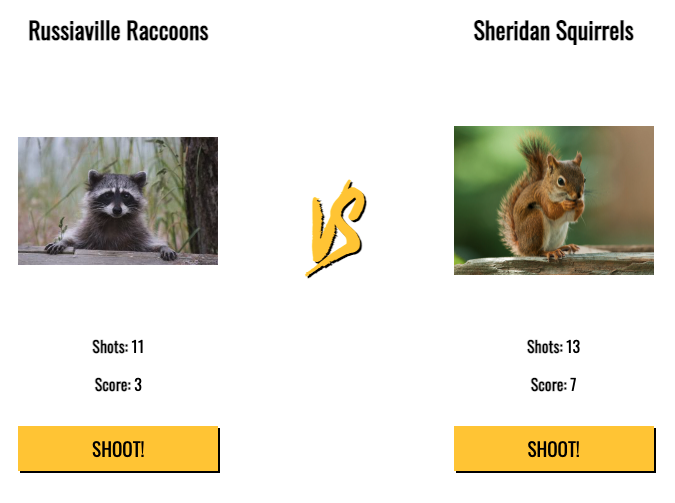

# react-sports-game-direction

1. Create a team component which takes in a teamName prop and displays the team name.
2. The team component should also take in an image prop and display the image on the page.
3. The team component should keep track of the team's score locally in a state variable.
4. The team component should have a button that increments the shots counter every time it is clicked.
5. The Score counter should have a random chance to increment every time the shoot button is clicked.

Example Of Finished App:
